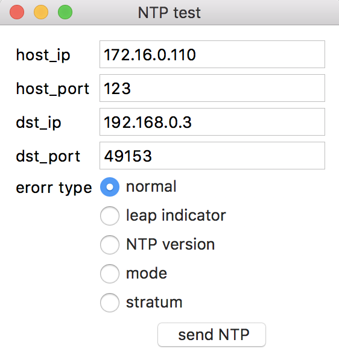

## NTP Tester



### main.py

```python
import socket
import sys
from contextlib import closing
import tkinter as tk

class Application(tk.Frame):
    def __init__(self, master=None):
        tk.Frame.__init__(self, master)
        self.pack()

        self.dst_ip = tk.StringVar()
        self.dst_port = tk.IntVar()
        self.host_ip = tk.StringVar()
        self.host_port = tk.IntVar()

        self.dst_ip.set('192.168.0.3')
        self.dst_port.set(49153)
        self.host_ip.set('172.16.0.110')
        self.host_port.set(123)

        self.flags = [0b00011100]
        self.stratum = [0x01]
        self.interval = [0x00]
        self.precision = [0xfa]
        self.delay = [0x00, 0x00, 0x00, 0x00]
        self.dispersion = [0x00, 0x0a, 0x36, 0x58]
        self.ref_id = [0x4c, 0x4f, 0x43, 0x4c]
        self.ref_timestamp = [0xda, 0xf7, 0x6d, 0x9f, 0x0c, 0xa1, 0xd5, 0xa8]
        self.org_timestamp = [0xd8, 0x4f, 0x0c, 0x84, 0x00, 0x00, 0x00, 0x00]
        self.rcv_timestamp = [0xda, 0xf7, 0xb0, 0x00, 0xd4, 0xd2, 0xfc, 0x91]
        self.snd_timestamp = [0xda, 0xf7, 0xb0, 0x00, 0xd4, 0xd2, 0xfc, 0x91]

        # erorr type setting
        self.e_type = tk.IntVar()
        self.e_type.set(0)
        self.func_table = (self.setNormal, self.setLeapIndicatorErorr,
                self.setVersionNumberErorr, self.setModeErorr, self.setStratumErorr)
        self.name_table = ("normal", "leap indicator", "NTP version",
                            "mode", "stratum")

        # start App.
        self.createWidgets()


    def createWidgets(self):
        tk.Label(self, text="host_ip").grid(column=0, row=0, sticky="w")
        hostip = tk.Entry(self, width=20, textvariable=self.host_ip)
        hostip.grid(column=1, row=0, sticky="w")

        tk.Label(self, text="host_port").grid(column=0, row=1, sticky="w")
        hostport = tk.Entry(self, width=20, textvariable=self.host_port)
        hostport.grid(column=1, row=1, sticky="w")

        tk.Label(self, text="dst_ip").grid(column=0, row=2, sticky="w")
        dstip = tk.Entry(self, width=20, textvariable=self.dst_ip)
        dstip.grid(column=1, row=2, sticky="w")

        tk.Label(self, text="dst_port").grid(column=0, row=3, sticky="w")
        dstport = tk.Entry(self, width=20, textvariable=self.dst_port)
        dstport.grid(column=1, row=3, sticky="w")

        tk.Label(self, text="erorr type").grid(column=0, row=4, sticky="w")
        for i, name in enumerate(self.name_table):
            radioB = tk.Radiobutton(self, text=name, value=i, variable=self.e_type)
            radioB.grid(column=1, row=i+4, sticky="w")

        b_send = tk.Button(self, text=" send NTP ", command=self.send)
        b_send.grid(column=1, row=9, columnspan=1)

        self.grid(padx=10,pady=10)

    def setNormal(self):
        self.flags = [0b00011100]
        self.stratum = [0x01]

    def setLeapIndicatorErorr(self):
        self.flags = [0b11011100]
        self.stratum = [0x01]

    def setVersionNumberErorr(self):
        self.flags = [0b00001100] # VN1
        self.stratum = [0x01]

    def setModeErorr(self):
        self.flags = [0b00000011] # modeC
        self.stratum = [0x01]

    def setStratumErorr(self):
        self.flags = [0b00011100]
        self.stratum = [0x10]

    def send(self):
        func = self.func_table[self.e_type.get()]
        func()

        # create NTP header
        pkt = self.flags + self.stratum + self.interval \
            + self.precision + self.dispersion + self.ref_id \
            + self.ref_timestamp + self.org_timestamp \
            + self.rcv_timestamp + self.snd_timestamp

        # send NTP packet
        s = socket.socket(socket.AF_INET, socket.SOCK_DGRAM)
        s.bind((self.host_ip.get(), self.host_port.get()))
        with closing(s):
            s.sendto(bytearray(pkt), (self.dst_ip.get(), self.dst_port.get()))

root = tk.Tk()
root.title("NTP test")
app = Application(master=root)
app.mainloop()
```
